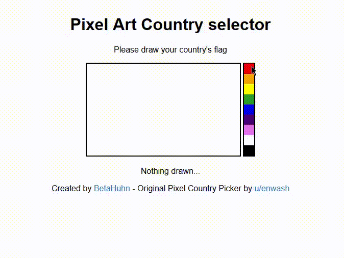

# Node.js Pixel art country picker

## Live Demo
The live demo of the country picker can be found here: https://flags.mxis.ch

## Introduction
This is an extension of [@enwash's](https://github.com/enwash) original [pixel-country-picker](https://github.com/enwash/pixel-country-picker). But instead of comparing the drawn flag directly to previously saved flags, this version goes through all saved flags and counts the matching pixels. The country whose flag has the most matching pixels will be displayed as the result. Using this technique you don't have to draw an exact match of the Flag and it detects the right country pretty early.

This repo also includes the code for the [colorPicker](https://flags.mxis.ch) node.js app in the src folder.
The updated version of [@enwash's](https://github.com/enwash) original [pixel-country-picker](https://github.com/enwash/pixel-country-picker) can be found in the colorPicker folder

## Contribution
If you want to add a new flag you can visit https://flags.mxis.ch/add and simply draw it. It will be publicly available on the home page.

## About
Original idea and code for the country picker by [@enwash](https://github.com/enwash/pixel-country-picker), the app for adding new flags and the updated country picker
where developed by [me](https://github.com/BetaHuhn) (Maximilian Schiller)
